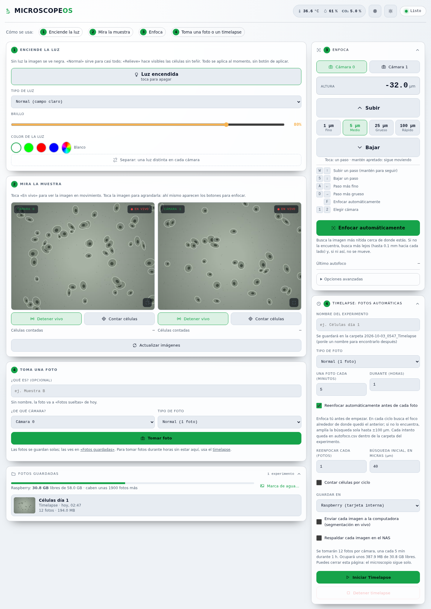
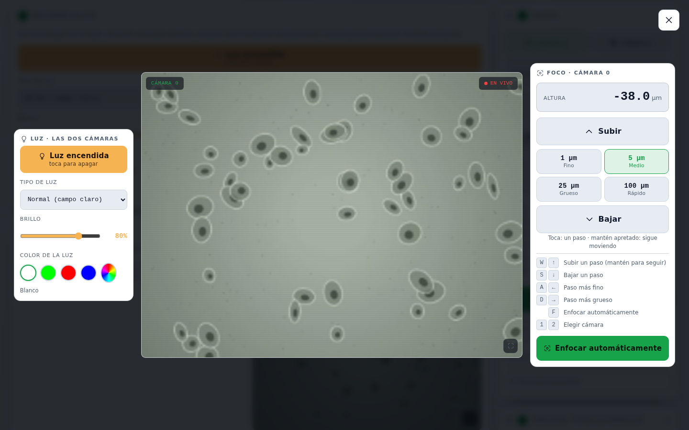
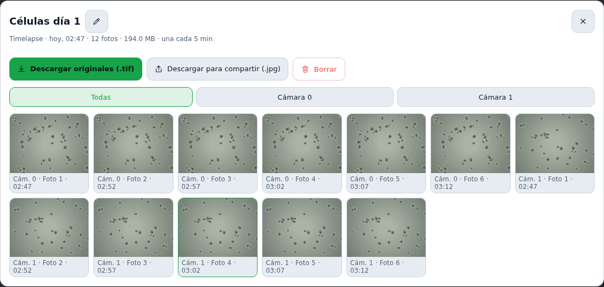
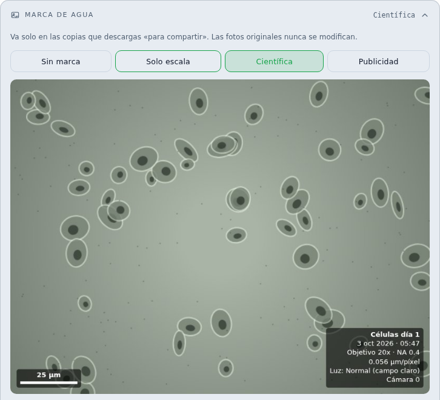
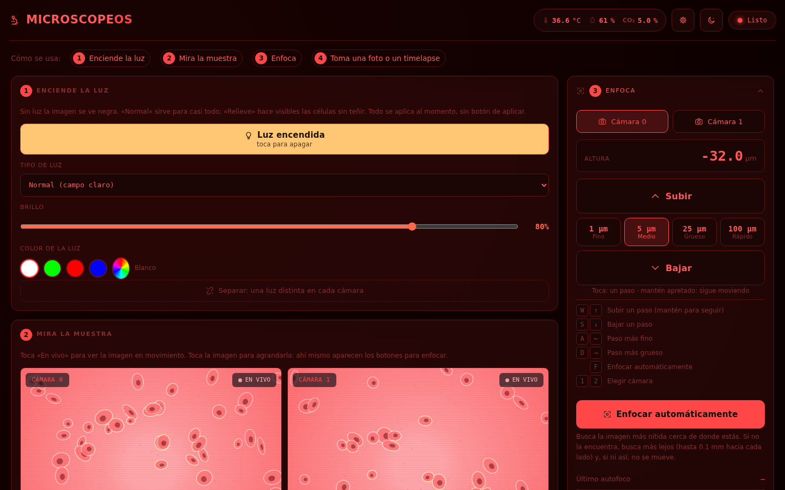
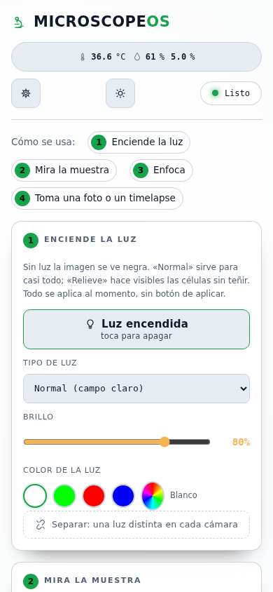
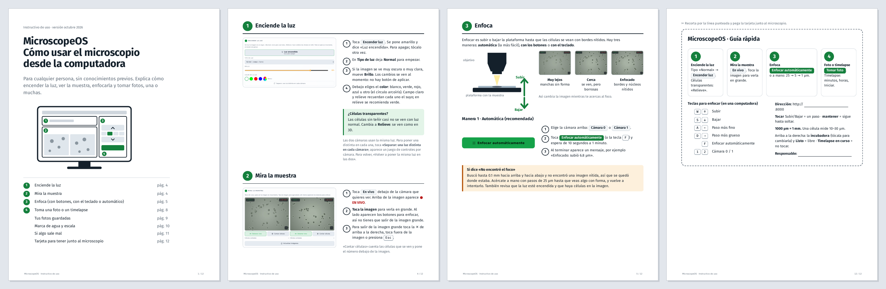

# MicroscopeOS

Controlador de un microscopio de dos cámaras para timelapses largos (hasta
48 h) de cultivos celulares vivos dentro de una incubadora, sobre
**Raspberry Pi 5**. Captura en **TIFF 16-bit** a resolución nativa del
sensor, ilumina en campo claro / campo oscuro / **DPC (Differential Phase
Contrast)** / **Rheinberg**, enfoca y reenfoca solo con un autofoco de dos
etapas, y registra temperatura y CO₂ sincronizados con cada ciclo de
captura.

Se opera desde una **página web**, sin instalar nada del lado del
usuario: en el laboratorio por la red local, y desde cualquier lugar con
internet por un túnel de Cloudflare con login por correo
([acceso remoto](docs/ACCESO_REMOTO.md)). Corre como servicio de arranque
automático en la Pi.



<sub>Capturas tomadas con el microscopio simulado del instructivo
(`docs/capturas/regenerar.sh`); la página es la misma que sirve la Pi.</sub>

## Contenido

- [Un sistema IoT de laboratorio](#un-sistema-iot-de-laboratorio)
- [La interfaz web](#la-interfaz-web)
- [Instructivo de uso](#instructivo-de-uso)
- [Funciones](#funciones)
- [Por qué DPC](#por-qué-dpc)
- [Instalación](#instalación) · [Uso](#uso) · [API](#api)
- [Dónde se guardan las fotos](#dónde-se-guardan-las-fotos)
- [Estructura](#estructura) · [Tests](#tests) · [Hardware](#hardware) · [Estado](#estado) · [Proyectos relacionados](#proyectos-relacionados)

## Un sistema IoT de laboratorio

El microscopio es un sistema IoT completo, de los sensores a la nube:

```
                 Navegador (en el laboratorio o desde cualquier lugar)
                       │                              │
                 red local :8000         https://microscopio.lmimenchacalab.com
                       │                              │
                       │                Cloudflare Access (login por correo)
                       │                              │
                       │                 túnel saliente cloudflared (QUIC)
                       ▼                              ▼
          ┌──────────── Raspberry Pi 5 — FastAPI (HTTP + SSE) ────────────┐
          │  autofoco · conteo de células · DPC por ciclo · timelapse     │
          └──┬──────────────┬──────────────────┬───────────────┬──────────┘
             │ CSI          │ USB serial       │ UART          │ USB serial
       2× IMX219      2× ESP32-S3-Matrix   2× TMC2209      Arduino (PID)
       (cam0/cam1)    (DPC/oscuro/         + NEMA11        DS18B20 · SCD30
                       Rheinberg)          (eje Z)         calefactor · válvula CO₂
             │
             └──► red local: cada imagen a la PC con GPU (segmentación
                  Cellpose-SAM en vivo) y respaldo en un NAS por SMB
```

| Capa | En este proyecto |
|---|---|
| **Sensado** | Dos cámaras IMX219, temperatura (DS18B20), CO₂ (SCD30) |
| **Actuación** | Matrices LED de iluminación, motores de enfoque, calefactor, válvula de CO₂ |
| **Nodos embebidos** | 2× ESP32-S3 (iluminación) y un Arduino con el PID de la incubadora, independiente del timing de la Pi |
| **Borde (edge)** | La Pi adquiere, enfoca, cuenta células y calcula el DPC de cada ciclo; lo pesado (segmentación) se manda a la PC |
| **Procesamiento en la PC** | Segmentación con Cellpose-SAM y seguimiento de la migración celular en [pipeline-migracion-celular](https://github.com/AFMMenchacalab/pipeline-migracion-celular) |
| **Conectividad** | HTTP/SSE en la red local, descubrimiento de la PC por difusión UDP, SMB al NAS, túnel de Cloudflare a internet |
| **Aplicación** | Página web con video en vivo, control y telemetría, accesible desde la página del laboratorio |
| **Seguridad** | Cloudflare Access con código por correo y lista cerrada de miembros; HTTPS de punta a punta |
| **Mantenimiento remoto** | Actualización desde GitHub con un botón, con vuelta atrás si la versión nueva no compila |

Detalle del túnel, la seguridad y cómo entrar: **[docs/ACCESO_REMOTO.md](docs/ACCESO_REMOTO.md)**.

## La interfaz web

Pensada para alguien que nunca usó el microscopio: cuatro pasos
numerados (enciende la luz, mira la muestra, enfoca, toma una foto o un
timelapse), todo se aplica al momento y sin botón de «aplicar». Arriba
quedan siempre a la vista la temperatura, la humedad y el CO₂ de la
incubadora.

<table>
<tr>
<td width="50%"></td>
<td width="50%"></td>
</tr>
<tr>
<td><b>Imagen ampliada.</b> Al tocar una cámara se agranda, con la luz y
el foco al lado para enfocar sin salir. También se enfoca con el teclado
(<kbd>W</kbd>/<kbd>S</kbd> o flechas, <kbd>F</kbd> autofoco).</td>
<td><b>Fotos guardadas.</b> Cada experimento con su nombre, sus fotos por
cámara y descarga de los originales (.tif) o de copias para compartir
(.jpg).</td>
</tr>
<tr>
<td></td>
<td></td>
</tr>
<tr>
<td><b>Marca de agua.</b> Barra de escala en micras, datos de la foto y
logo, solo en las copias para compartir; los .tif originales nunca se
tocan.</td>
<td><b>Tema noche.</b> En rojo, para trabajar con la luz del cuarto
apagada sin encandilarse. También hay tema claro.</td>
</tr>
</table>

<p align="center">

<br><sub>También funciona desde el celular.</sub>
</p>

La página anterior, más técnica, sigue disponible en `/clasica`.

## Instructivo de uso

**[Instructivo_MicroscopeOS.pdf](docs/instructivo/Instructivo_MicroscopeOS.pdf)**:
12 páginas tamaño carta para imprimir, pensado para alguien sin
experiencia. Explica cómo encender la luz, ver la muestra, enfocar (con
botones, con el teclado o de forma automática), tomar fotos y
timelapses, las fotos guardadas, la marca de agua y la escala. Incluye una
tabla de problemas y una tarjeta para recortar y dejar junto al
microscopio.



Cómo regenerarlo si cambia la interfaz: [docs/instructivo/LEEME.md](docs/instructivo/LEEME.md).

## Funciones

**Imagen**

- **Captura raw 16-bit** sin pérdida, a la resolución nativa del sensor
  (recorte de stride del pipeline PiSP ya resuelto), y vivo simultáneo de
  las dos cámaras con el campo completo del sensor.
- **Cuatro modos de iluminación**: campo claro, DPC o «relieve» (4
  capturas L/R/T/B), campo oscuro (anillo exterior) y Rheinberg (dos
  colores simultáneos, centro + anillo). El color de la luz se elige por
  cámara, y cada cámara puede tener una luz distinta.
- **DPC calculado en la Pi al terminar cada ciclo** (`core/dpc.py`):
  guarda el relieve izquierda-derecha y arriba-abajo, más un campo claro
  reducido, comprimidos sin pérdida, comprueba que se escribieron bien y
  recién ahí borra las 4 crudas. Un ciclo pasa de ~65 MB a ~25 MB por
  cámara; una noche con dos cámaras llegaba a ~60 GB.
- **Metadatos dentro de cada .tif** (`core/metadatos.py`): objetivo,
  escala, luz, exposición, foco, temperatura y experimento. Fiji/ImageJ
  abren la imagen ya con la escala en micras.
- **Óptica por cámara** (`core/optica.py`): objetivo y escala µm/píxel,
  estimada a partir del sensor o medida con un portaobjetos micrométrico.

**Timelapse**

- Captura secuencial o simultánea de las dos cámaras, telemetría de
  temperatura/CO₂ por ciclo y reenfoque automático opcional cada N
  ciclos, con un límite de deriva para no llevar el objetivo contra la
  muestra.
- **Se reanuda solo después de un corte de luz**: al volver a arrancar,
  espera a que la hora se sincronice y a que aparezca la carpeta (una
  memoria USB tarda en montarse) y sigue donde iba.
- Vista de la última foto de cada cámara mientras corre.

**Enfoque**

- **Motorizado por cámara**: botones y joystick continuo desde la web
  (con watchdog: si se corta la conexión, el motor se frena solo),
  teclado, pasos en micras (1 / 5 / 25 / 100 µm) y resolución ajustable
  en caliente entre 1/1 y 1/256 de paso.
- **Autofoco de dos etapas**:
  1. *Salto grueso con dirección*: mide el corrimiento con signo entre
     las dos medias iluminaciones (correlación de fase, precisión de
     subpíxel) y corrige de una vez, sin barrer. Requiere calibrar una
     vez por objetivo (`/api/focus/calibrar`); la calibración ya deja la
     cámara enfocada, porque el foco es donde la recta
     corrimiento-vs-posición cruza el cero.
  2. *Ajuste fino*: cerca del foco una sola lectura es ruidosa, así que
     se mide en 7 planos cercanos y se toma la mediana de las 7
     estimaciones del cero. No se usa una métrica de nitidez: el
     Tenengrad sobre el DPC es casi plano cerca del foco con células sin
     teñir y tiene un *valle* con muestras que absorben.

  Sin calibrar, si la correlación no engancha (campo vacío) o si una
  corrección empeora en vez de acercar, vuelve a la posición inicial y
  cae a un barrido grueso-a-fino que busca **el mismo criterio**, así que
  los dos métodos terminan en el mismo plano. Ninguno se aleja más de
  ±rango/2 de donde arrancó, y todo movimiento final se alcanza desde el
  mismo sentido para no arrastrar el juego mecánico del husillo.

  Hay una tercera vía **opcional y todavía sin entrenar**: un regresor
  que estima el desenfoque directamente del par de medias aperturas. La
  inferencia y la grabación del dataset están implementadas
  (`/api/focus/pila` → `extras/ia/entrenar_autofoco.py`); sin
  `profiles/autofoco_ia.onnx` no se activa.

**Análisis**

- **Conteo de células** sobre el vivo y sobre las capturas, en modo
  manual (por defecto: mide una vez y deja el número en pantalla) o
  automático. En un timelapse se cuenta cada N ciclos y queda una curva
  de población con su tiempo de duplicación y la marca de los ciclos
  donde algo cambió de golpe.

  La segmentación es clásica: busca **energía local a escala de
  célula**, no brillo, porque en el DPC una célula sale en relieve con el
  centro al gris del fondo y un umbral de brillo cuenta los dos lóbulos
  por separado. Distingue un campo vacío (o la luz apagada) de un cultivo
  confluente. El vivo necesita iluminación oblicua: en campo claro una
  célula sin teñir se anula justo en el foco (en simulación, con 40 células de fase:
  campo claro **0**, media apertura **40**, DPC **40**), así que el
  conteo pone la matriz en media apertura para medir.

**Datos y red**

- **Experimentos con nombre** (`core/experimentos.py`): cada timelapse o
  serie de fotos va a una carpeta con fecha y nombre legibles, con un
  `LEEME.txt` para personas y un `experimento.json` para programas.
  Borrar manda a una papelera de 7 días.
- **Galería** en la página: ver, renombrar, borrar, descargar los
  originales o un .zip, y copias para compartir con **marca de agua**
  (`core/marca_agua.py`).
- **Memoria USB**: guardar ahí el próximo timelapse, copiar uno ya hecho
  y expulsarla de forma segura. Ver [docs/USB_Y_ENVIO_PC.md](docs/USB_Y_ENVIO_PC.md).
- **Envío a la computadora**: cada imagen se manda a la PC al guardarse,
  donde se segmenta en vivo con Cellpose-SAM (receptor y segmentador en
  [pipeline-migracion-celular](https://github.com/AFMMenchacalab/pipeline-migracion-celular)). La PC se encuentra sola
  en la red y se empareja con un código de 6 dígitos; con cola y
  reintentos, un corte de red no frena ni pierde el timelapse.
- **Respaldo en un NAS** por SMB (`core/respaldo_nas.py`), en paralelo
  con el envío a la PC y sin competir con él por el ancho de banda.
- **Acceso remoto** por túnel de Cloudflare con login por correo: ver
  [docs/ACCESO_REMOTO.md](docs/ACCESO_REMOTO.md).
- **Actualizar desde la página**: ver [Actualizar](#actualizar).

## Por qué DPC

Las células vivas sin teñir no absorben luz: solo retrasan el frente de
onda que las atraviesa. Son objetos de **fase**, invisibles en campo claro
salvo por el contraste que aporta el propio desenfoque. El DPC ilumina con
mitades opuestas de una matriz de LEDs y resta las dos capturas,
`(I_izq − I_der)/(I_izq + I_der)`, convirtiendo ese gradiente de fase en
contraste de amplitud real, sin teñir ni dañar la muestra.

Esa misma iluminación oblicua es la base del autofoco: bajo media
apertura, un plano fuera de foco se proyecta *de lado*, y hacia lados
opuestos según qué mitad de la matriz esté encendida. Ese corrimiento
tiene signo (dice hacia dónde mover el eje, no solo cuánto está
desenfocado), así que enfocar no requiere barrer a ciegas.

### Detalles de la arquitectura

- **Cámaras**: dos `Picamera2` persistentes (una instancia por cámara,
  abierta una sola vez). Pueden disparar en paralelo (`capture_both`)
  porque cada una tiene su propio puerto CSI.
- **Iluminación**: no es GPIO directo. Cada matriz es una placa ESP32-S3
  aparte, identificada por regla udev (`/dev/matriz_cam0`,
  `/dev/matriz_cam1`) sin importar el orden de enumeración USB. Protocolo
  de línea por serial: `core/illumination.py` y el firmware en
  [`codigo/extras/matrices_esp32s3_matrix/`](codigo/extras/matrices_esp32s3_matrix/).
- **Enfoque**: un motor NEMA11 + driver TMC2209 por cámara, los dos
  drivers en un único bus UART (modo multi-esclavo, cada uno en su
  dirección). Cableado completo en el docstring de
  [`core/motor_focus.py`](codigo/MicroscopeOS/core/motor_focus.py).
- **Temperatura/CO₂**: lazo PID en un **Arduino separado**, no en la Pi,
  para que no dependa del timing de la Pi mientras escribe TIFFs de
  16 MB.

## Instalación

Raspberry Pi OS (Bookworm o Trixie) de 64 bits en Pi 5.

Las dependencias de hardware (`picamera2`, `opencv`, `numpy`, `pyserial`,
GPIO) van **con apt**, no con pip: los paquetes de pip no traen los
bindings nativos de libcamera ni del chip GPIO.

```bash
sudo apt install -y python3-picamera2 python3-opencv python3-numpy \
                    python3-serial python3-rpi-lgpio python3-gpiozero \
                    python3-venv git
```

El entorno virtual hereda esos paquetes del sistema:

```bash
python3 -m venv --system-site-packages venv
source venv/bin/activate
pip install -r docs/requirements.txt
```

Además hace falta, en `config.txt`/`cmdline.txt`: habilitar las dos
cámaras IMX219 (`camera_auto_detect=0` + overlays `imx219`), liberar
GPIO14/15 sacando la consola serie (`dtparam=uart0=on` para los drivers
de enfoque), y las reglas udev de las matrices de iluminación
(`configs/udev/`) y del usuario en el grupo `uucp`.

Para el acceso desde internet, instalar el túnel siguiendo
[docs/ACCESO_REMOTO.md](docs/ACCESO_REMOTO.md#volver-a-instalar-el-túnel-en-otra-pi).

## Uso

```bash
cd codigo/MicroscopeOS
python3 run_web.py
# abrir http://<ip-de-la-pi>:8000
```

> Ejecutar siempre desde `codigo/MicroscopeOS/`: la API sirve
> `server/static/` con rutas relativas al directorio de trabajo.

Como servicio de arranque automático:

```bash
sudo cp configs/systemd/microscopeos.service /etc/systemd/system/
sudo systemctl enable --now microscopeos
```

| Dirección | Qué es |
|---|---|
| `http://<ip-de-la-pi>:8000/` o `/ui` | La página del microscopio, desde la red del laboratorio |
| `https://microscopio.lmimenchacalab.com/ui` | La misma página desde internet, con login por correo |
| `/clasica` | La página anterior, más técnica |

### Actualizar

Desde la página: **Ajustes › Actualizar el programa**. Cuando GitHub
tiene una versión nueva en `master`, el encabezado muestra
«Actualización disponible» (se revisa al abrir la página y cada hora).
El botón trae la versión nueva y reinicia el servidor (con systemd,
`Restart=on-failure` lo vuelve a levantar). No toca fotos (`datos/`) ni
ajustes; el código cambiado a mano en la Pi queda en `git stash` y los
commits locales en una rama `respaldo/…`. Si la versión nueva no
compila, se queda la anterior. Otra rama: variable `MICROSCOPEOS_RAMA`.

## API

Lo que usa la página, agrupado. El detalle de cada endpoint está en
[`server/api.py`](codigo/MicroscopeOS/server/api.py) y FastAPI lo
documenta solo en `/docs`.

| Grupo | Endpoints |
|---|---|
| Vivo y vista previa | `GET /live/stream/{cam}` (MJPEG) · `POST /live/start/{cam}` · `/live/stop/{cam}` · `/live/stop` · `GET /preview/{cam}` |
| Iluminación | `POST /light/set` (modo, brillo, colores) · `/light/on` · `/light/off` · `/light/colores` · `GET/POST /light/color_dpc` · `GET /light/estado` · `POST /brightness` |
| Cámara | `POST /exposure` · `GET /camera/calibracion` · `POST /camera/calibrar` · `/camera/calibracion/borrar` |
| Captura | `POST /capture/{cam}/{modo}` · `/capture/both/{modo}` (las dos **en paralelo**) |
| Timelapse | `POST /timelapse/start` · `/timelapse/stop` · `GET /status` · `GET /timelapse/vista/{cam}` |
| Enfoque | `POST /api/focus/move` · `/jog` · `/jog/stop` (watchdog de 1,5 s) · `/config` · `/auto` · `/calibrar` · `/pila` · `GET /api/focus/status` |
| Conteo de células | `GET /api/analisis/estado` · `POST /api/analisis/config` · `/medir` · `/foto` · `/timelapse` |
| Incubadora | `GET /api/temperature/status` · `/stream` (SSE) · `POST /api/temperature/setpoint` |
| Experimentos y galería | `GET /api/experimentos` · `GET /api/exp/{id}` y sus `/mini`, `/original`, `/info`, `/compartir`, `/zip` · `POST /api/exp/{id}/renombrar` · `/borrar` · `/usb` · `POST /api/papelera/restaurar` |
| Óptica y marca de agua | `GET/POST /api/optica` · `GET/POST /api/marca` · `GET /api/marca/vista` · `POST /api/marca/logo` · `/logo/quitar` |
| USB, PC y NAS | `GET /api/usb/estado` · `POST /api/usb/expulsar` · `/copiar` · `GET /api/envio/estado` · `POST /api/envio/config` · `/buscar` · `/probar` · `/reenviar` · lo mismo en `/api/nas/…` |
| Programa | `GET /api/version` · `GET /api/actualizacion` · `POST /api/actualizar` · `/profiles/list` · `/profiles/load/{n}` · `/profiles/save` · `/profiles/delete/{n}` |
| Archivos (versión anterior) | `GET /files/list` · `/files/thumb/…` · `/files/raw/…` · `/files/zip/…` |

## Dónde se guardan las fotos

Todo va a `codigo/MicroscopeOS/datos/`, una carpeta por experimento con
la fecha primero para que cualquier explorador de archivos los ordene
solo:

```
datos/
├── 2026-10-02_1030_Celulas_dia_1/         # un timelapse
│   ├── LEEME.txt                          # qué es cada cosa, para personas
│   ├── experimento.json                   # lo mismo, para programas
│   ├── cam0/0001_2026-10-02_10-30-00.tif  # modo normal: una foto por ciclo
│   ├── cam0/0001_..._dpcLR.tif            # modo relieve: DPC izq-der
│   ├── cam0/0001_..._dpcTB.tif            #               DPC arriba-abajo
│   ├── cam0/0001_..._suma.tif             #               campo claro reducido
│   ├── cam1/...
│   ├── temperatura.csv                    # telemetría por ciclo
│   ├── autofoco.csv                       # con reenfoque: deriva del foco
│   ├── conteo.csv · poblacion.png         # con conteo: células por ciclo y curva
│   ├── eventos.csv                        # ciclos con saltos, caídas o pérdida de foco
│   └── timelapse.log
├── 2026-10-02_Fotos_sueltas/              # «Tomar foto» sin nombre
└── .papelera/                             # lo borrado, 7 días
```

En modo relieve las 4 crudas (`_L _R _T _B`) solo se conservan si se
pide; si no, se borran en cuanto el DPC del ciclo quedó bien escrito.
Formato y fórmula para volver al valor físico en el docstring de
[`core/dpc.py`](codigo/MicroscopeOS/core/dpc.py).

## Estructura

| Ruta | Contenido |
|---|---|
| `codigo/MicroscopeOS/core/` | Cámara, iluminación, timelapse, enfoque, autofoco, DPC, análisis de imagen, experimentos, metadatos, óptica, marca de agua, USB, envío a la PC, NAS, actualización |
| `codigo/MicroscopeOS/server/` | API FastAPI + páginas web (`index_uiux.html` en `/ui`, `index.html` en `/clasica`) |
| `codigo/MicroscopeOS/interfaces/` | GUI de escritorio en PyQt6 (no usada en producción; el modo activo es la web) |
| `codigo/extras/ia/` | Entrenamiento del autofoco aprendido (corre fuera de la Pi) |
| `codigo/extras/matrices_esp32s3_matrix/` | Firmware de las matrices de iluminación + protocolo |
| `codigo/extras/incubadora_temperatura/` | Sketches del PID de temperatura/CO₂ |
| `configs/` | Unidad systemd, reglas udev, `config.txt`/`cmdline.txt` de arranque, ejemplo del túnel de Cloudflare |
| `docs/` | Instructivo, acceso remoto, USB y envío a la PC, capturas del README, historia de la migración desde la Pi 4 |
| `tests/` | Suites sin hardware (emuladores de cámara, matrices y drivers) |
| `TODO_HW.md` | Validaciones pendientes que requieren hardware físico conectado |

## Tests

Corren en cualquier máquina, sin Pi ni hardware: sustituyen `picamera2`,
`tifffile` y `serial.Serial` por emuladores que hablan el protocolo real
(incluido el datagrama UART del TMC2209 sobre un bus compartido, y una
cámara simulada con la física del DPC: desenfoque, corrimiento con signo
bajo media apertura, y objetos de fase que se anulan en campo claro).

```bash
cd tests
for t in test_migracion test_motores test_analisis test_dpc \
         test_archivos test_reanudar test_actualizar; do
  SP=$PWD PROY=$PWD/../codigo/MicroscopeOS python3 $t.py
done
```

Detalle de qué cubre cada suite en [`tests/README.md`](tests/README.md).

## Hardware

- Raspberry Pi 5 Model B (8 GB)
- 2× cámara IMX219 (8 MP), CSI nativo
- 2× Waveshare ESP32-S3-Matrix (8×8 WS2812B) para iluminación
- 2× NEMA11 28HB30-401A + driver TMC2209, uno por cámara, sobre
  plataforma lineal T6×1; bus UART compartido, cableado en
  `core/motor_focus.py`
- Arduino (Uno/Nano) + DS18B20 + SCD30 + calefactor PWM + válvula
  solenoide, para el control ambiental de la incubadora

## Estado

Validado en hardware real: las dos cámaras capturan TIFF 16-bit a
resolución nativa, los cuatro modos de iluminación responden y se
confirmaron visualmente en el microscopio, los dos ejes de enfoque
mueven limpio con UART y motor probados de punta a punta, y el acceso
remoto por el túnel funciona con el login por correo (probado también sin
sesión iniciada: todo redirige al login). El detalle de qué falta validar
y por qué está en **[TODO_HW.md](TODO_HW.md)**.

## Proyectos relacionados

- **[pipeline-migracion-celular](https://github.com/AFMMenchacalab/pipeline-migracion-celular)**:
  el análisis que corre en la PC con las imágenes que manda el
  microscopio. Segmenta con Cellpose-SAM, sigue cada célula con laptrack
  y mide la persistencia de la migración (células MDA-MB-231). Ahí están
  el receptor (`31_receptor_microscopio.py`) y el segmentador en vivo
  (`32_segmentar_en_vivo.py`) del [envío a la PC](docs/USB_Y_ENVIO_PC.md).
